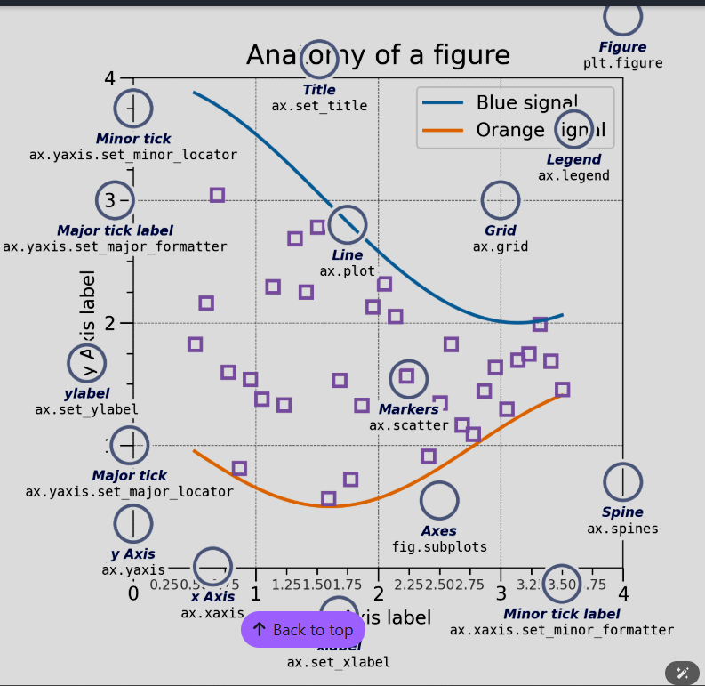

# matplotlibProjects
This repo contain matplotlib and numpy Projects I used to sharpen my datascience and ML skills

Thanks to:
 https://matplotlib.org/stable/users/explain/ ; 
 https://numpy.org/doc/stable/reference/random/generator.html#numpy.random.default_rng
 https://matplotlib.org/stable/users/explain/quick_start.html

Cheatsheet:

